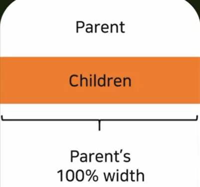
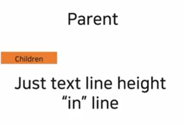
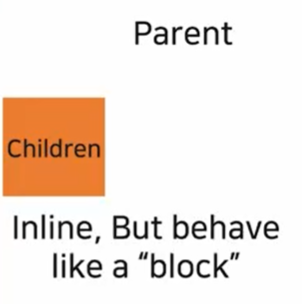
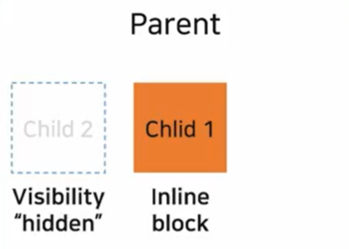
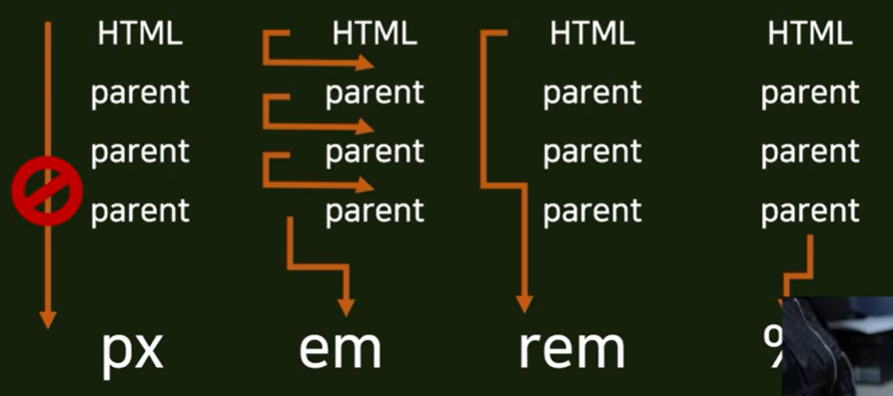
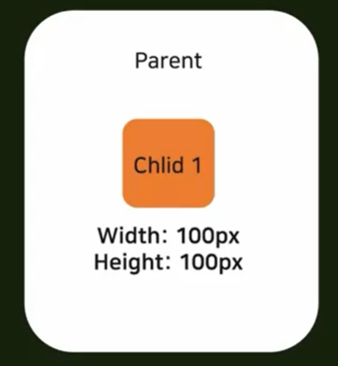
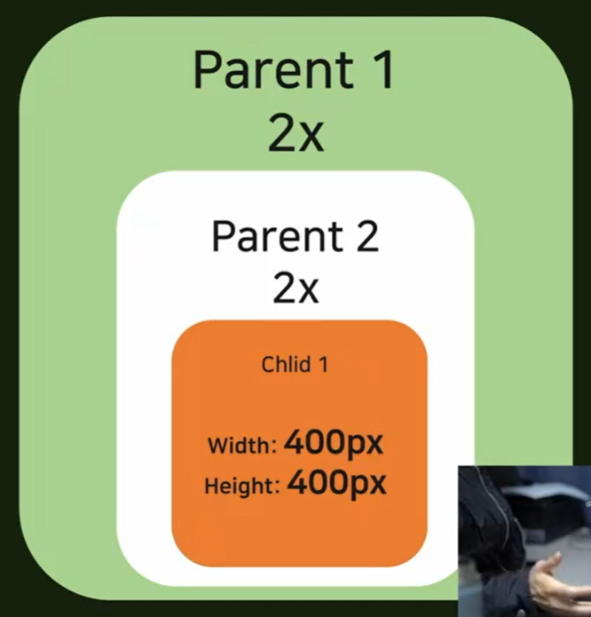
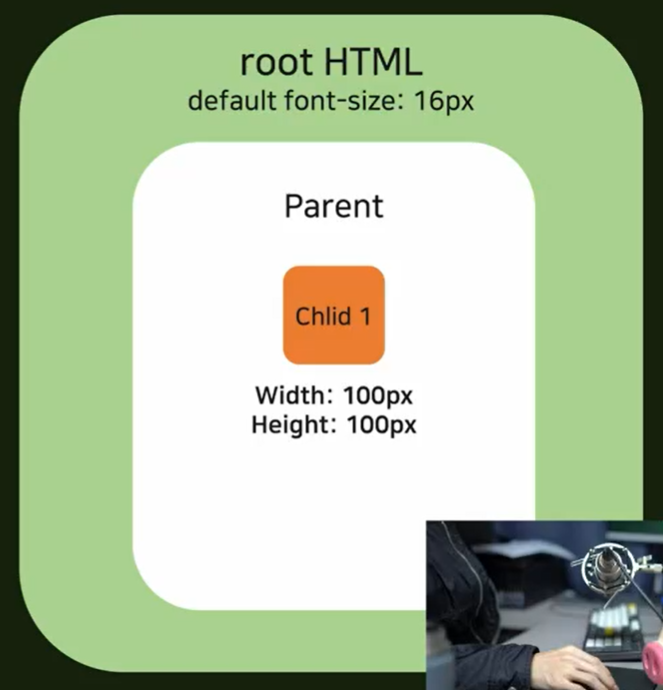

# CSS

### 1. 개념

* Cascading Style Sheet

### 2. Display attribute

* Block

  * 블럭 자체의 크기가 어떻든 간에, 부모의 최대한의 너비를 가져간다

    

    

* Inline

  * 한 줄에 자식 태그가 여러개 쌓일 수 있음

    

* Inline-block

  * block이지만 inline처럼 한 줄에 여러개 쌓일 수 있음

    

* None

  * 시각화 되는 것이 없는 것
  * 태그상에는 존재함 ( 그런데 이거 왜 씀? ) :question:

### 3. Visibility Attribute

* Hidden

  * 보이지만 않을 뿐 존재하는 것

    

### 4. Size Attribute - related with Font-size 

* px (절대적)

  * 부모 사이즈가 어떻든, 자식의 크기는 독립적

  

* em (상대적)

  * 부모가 커지면 자식도 따라감

  * 단, 부모가 여러개 있을 때 문제가 발생한다.

    

    * 이렇게 부모가 2개 된다면, 두 개의 값을 더해서 (사진의 경우 *4) 커진다
    * 컨트롤 하기가 어려워짐. 잘 안쓴다. (계산 가능하면 해도 괜찮음)

* rem :crown:

  * root HTML의 크기와 상관있음

  * 대신 부모의 크기와는 관계 없음\

    

* %

  * 바로 위의 부모에만 영향을 받는다

#### 5. 우선순위

* 인라인

*  구문

* `.css`  파일