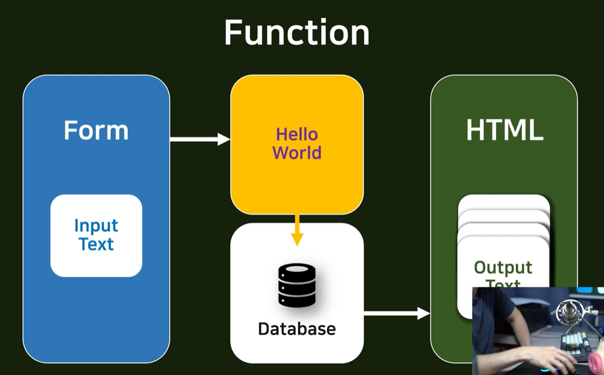

# Django

## :one: Model

* 장고 프레임워크와 DB를 연결시켜주는 역할
* 동적인 파일

## :two: CRUD

### 1. Function

* Form에서 Hello World에게 요청을 보낼 때, 아무나(anyone) 보낼 수 있다는 것
* 인증 시스템 구축이 필요함 (최소한의 보안)
* account, 즉 계정이 필요함

### 2. Account 생성 과정

#### 1) Sign Up (C)

* 회원가입

#### 2) Log in

* 로그인

#### 3) View info (R)

* 회원정보조회

#### 4) Change info (U)

* 회원정보수정

#### 5) Quit (D)

* 회원탈퇴

### 3. CRUD

1. CREATE
2. READ
3. UPDATE
4. DELETE

* 장고는 CRUD로 유명함 - 왜?
  * Django는 Class Based View(CBV)를 제공해줌
  * 또한, Function Based View(FBV)라고도 함
* 생산성, 가독성 향상 (Productivity, Readability)
* 복잡도, 시간 소모 낮아짐 (Complexity, Time spending)

